<div align="center">

🇫🇷 Français · <a href="./README.md">🇬🇧 English</a>

<!-- Animated header SVG -->


<!-- Typing animation -->
<a href="https://git.io/typing-svg"></a>

</div>

---

## 👾 À propos de moi

```bash
$ whoami
> stephane_talab

$ cat about.txt
Étudiant L3 Informatique à l'UPJV (Amiens).
Je fais du fullstack le jour, des CTF la nuit.
Pentest, web hacking, reverse engineering — j'apprends en cassant des trucs.
Mention Honorable à la compétition de code de l'Université d'Artois (2026).
```

---

## 🛠 Stack technique

<div align="center">

### Frontend


### Backend


### Bases de données


### Langages & Scripting


### Cybersécurité


</div>

---

## 📊 GitHub Stats

<div align="center">
  
  
</div>

<div align="center">
  
</div>

---

## 🚧 Projets en cours

| Projet | Description | Stack |
|--------|-------------|-------|
| 🌐 **Portfolio** | Site personnel avec études de cas et démos live | React · Next.js |
| 🔐 **CTF Lab** | Scripts & write-ups de mes challenges cybersec | Python · Bash |
| 🛒 **Web Apps client** | Applications pro pour entreprises & associations | Node.js · PostgreSQL · React |

> *D'autres projets arrivent — watch le repo pour être notifié.*

---

## 🏆 Highlights

- 🥇 **Mention Honorable** — Compétition de code, Université d'Artois @ l'ARC (2026)
- 🎯 **CTF Compétiteur** — Cryptographie, web hacking, reverse engineering (2024–2026)
- 🔒 **Stage Pentest** — Analyse de vulnérabilités, tests d'intrusion, rédaction de rapports (2022)
- 🎓 **L3 Informatique** — UPJV, Amiens · Spécialité gestion d'entreprise

---

## 📬 Me contacter

<div align="center">

[](mailto:ProGen180@gmail.com)
[](https://linkedin.com/in/ProGen18)
[](https://stephane-talab.fr)


</div>

---

<div align="center">
  
</div>
